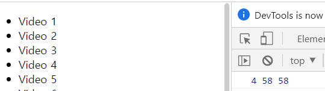

# Adding Up Times with Reduce


<br />

## 소개

<br />

- 각 비디오 `분:초`를 더하여 총 `시간:분:초` 로 나타내기

<br />

## JavaScript Code

<br />

```js

<script>
  const timeNodes = Array.from(document.querySelectorAll('[data-time]'));
  // querySelectorAll 은 forEach 써야함 따라서 [...] or Array from으로 묶기
  const seconds = timeNodes
    .map(node=> node.dataset.time)
    .map(timeCode=>{
      const [mins, secs] = timeCode.split(':').map(parseFloat);
      return (mins * 60 ) + secs;
    })
    .reduce((total, vidseconds)=> total + vidseconds);

   let secondsLeft = seconds;
   const hours = parseInt(secondsLeft / 3600); //Mathfloor
    secondsLeft %= 3600;
  const mins = parseInt(secondsLeft / 60);
  secondsLeft %= 60;

  console.log(hours, mins, secondsLeft);
</script>

```

<br />
