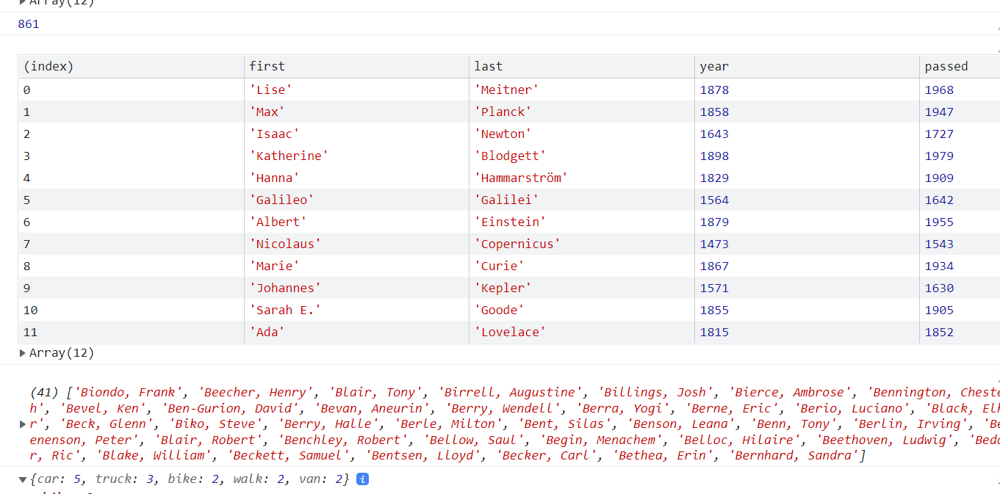

# Array Cario Day 1

<br />



<br />

## 소개

<br />

**회원 데이터 관리**

- 배열 내장함수를 사용한 JS Study

[구경하러 바로 가기](https://hilarious-mochi-2594dd.netlify.app/)

<br />

## JavaScript Code

<br />

```js
//js

// Array.prototype.filter()
// 1. Filter the list of inventors for those who were born in the 1500's
const fifteen = inventors.filter(
  (inventor) => inventor.year >= 1500 && inventor.year < 1600
);
console.table(fifteen);

// Array.prototype.map()
// 2. Give us an array of the inventors first and last names
const fullNames = inventors.map(
  (inventor) => `${inventor.first} ${inventor.last}`
);
console.log(fullNames);

// Array.prototype.sort()
// 3. Sort the inventors by birthdate, oldest to youngest
const ordered = inventors.sort((a, b) => (a.year > b.year ? 1 : -1));
console.table(ordered);
```

<br />

```js
// Array.prototype.reduce()
// 4. How many years did all the inventors live all together?
const totalYears = inventors.reduce(
  (total, inventor) => total + (inventor.passed - inventor.year),
  0
);
console.log(totalYears);

// 5. Sort the inventors by years lived
const oldest = inventors.sort((a, b) => {
  const lastGuy = a.passed - a.year;
  const nextGuy = b.passed - b.year;
  return lastGuy > nextGuy ? -1 : 1;
});
console.table(oldest);

// 6. create a list of Boulevards in Paris that contain 'de' anywhere in the name
// https://en.wikipedia.org/wiki/Category:Boulevards_in_Paris
// const category = document.querySelector('.mw-category');
// const links = Array.from(category.querySelectorAll('a'));
// const de = links
//             .map(link => link.textContent)
//             .filter(streetName => streetName.includes('de'));
```

<br />

```js
// 7. sort Exercise
// Sort the people alphabetically by last name
const alpha = people.sort((lastOne, nextOne) => {
  const [aLast, aFirst] = lastOne.split(", ");
  const [bLast, bFirst] = lastOne.split(", ");
  return aLast > bLast ? 1 : -1;
});
console.log(alpha);

// 8. Reduce Exercise
// Sum up the instances of each of these
const data = [
  "car",
  "car",
  "truck",
  "truck",
  "bike",
  "walk",
  "car",
  "van",
  "bike",
  "walk",
  "car",
  "van",
  "car",
  "truck",
];

const transportation = data.reduce((obj, item) => {
  if (!obj[item]) {
    obj[item] = 0;
  }
  obj[item]++;
  return obj;
}, {});
console.log(transportation);
```

<br />
