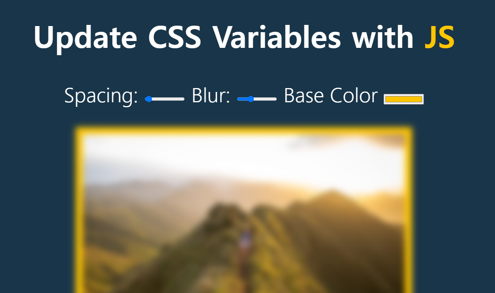

# CSS Variables



## 소개

<br />

**HTML Input 버튼을 이용하여 이미지의 여백, 흐림 정도, 배경색을 조절할 수 있는 웹 페이지**

[구경하러 바로 가기](https://bright-peony-27b89b.netlify.app/)

<br />

## CSS & JavaScript Code

<br />

```css
/*css*/
:root {
  --base: #ffc600;
  --spacing: 10px;
  --blur: 10px;
}

img {
  padding: var(--spacing);
  background: var(--base);
  filter: blur(var(--blur));
}

.hl {
  color: var(--base);
}
```

```js

<script>
//js
const inputs = document.querySelectorAll('.controls input');

function handleUpdate(){
    //dataset을 보면 sizing과 ''이 필요
    const suffix = this.dataset.sizing || '';
    //documetElement는 전체 html반환
    document.documentElement.style.setProperty(`--${this.name}`, this.value + suffix);
}

inputs.forEach(input => input.addEventListener('change',handleUpdate));
inputs.forEach(input => input.addEventListener('mousemove',handleUpdate));

</script>
```
