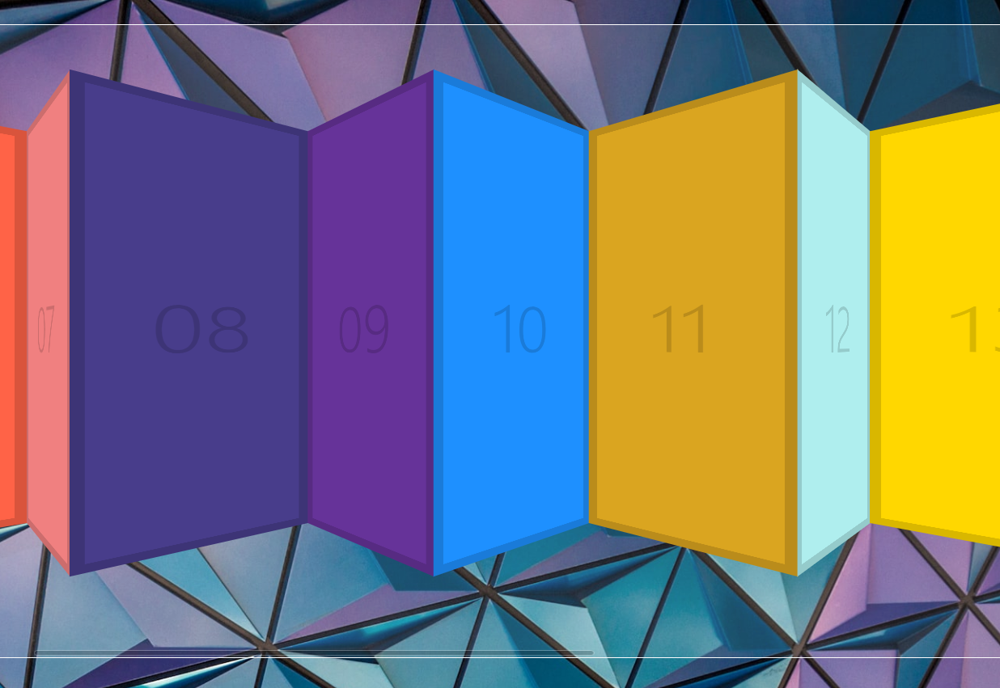

# Click and Drag


<br />

## 소개

<br />

**Click으로 Drag 할 수 있는 웹** <br />
[구경하러 바로 가기](https://inquisitive-syrniki-cc359e.netlify.app/)

<br />

## JavaScript Code

<br />

```js

<script>

  const slider = document.querySelector('.items');
  let isDown = false;
  let startX;
  let scrollLeft;

  slider.addEventListener('mousedown', (e) => {
    isDown = true;
    slider.classList.add('active');
    startX = e.pageX - slider.offsetLeft;
    scrollLeft = slider.scrollLeft;
    console.log(scrollLeft);
  });
  slider.addEventListener('mauseleave',()=>{
    isDown = false;
    slider.classList.remove('active');
  });
  slider.addEventListener('mouseup',()=>{
    isDown = false;
    slider.classList.remove('active');
  });
  slider.addEventListener('mousemove',(e)=>{
    if(!isDown) return;
    // console.log(startX);
    e.preventDefault();
    const x = e.pageX - slider.offsetLeft;
    // console.log(x, startX);
    const walk = x - startX;
    slider.scrollLeft = scrollLeft - walk;
  });

</script>

```

<br />
