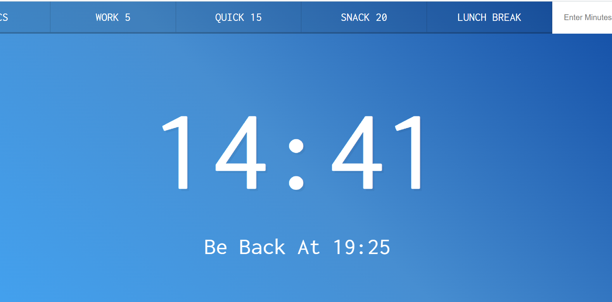

# Countdown Timer


<br />

## 소개

<br />

**타이머 기능이 구현된 웹** <br />
[구경하러 바로 가기](https://keen-axolotl-79c92e.netlify.app/)

<br />
<br />

## Study

<br />

1. preventDefault??

```js
document.customForm.addEventListener("submit", function (e) {
  e.preventDefault();
  const mins = this.minutes.value;
  timer(mins * 60);

  this.reset();
});
```

<br />

위의 코드를 보면 preventDefault를 사용하였다.

<br />

**preventDefault란?**

- a 태그나 submit 태그는 누르게 되면 href 를 통해 이동하거나 , 창이 새로고침하여 실행되는데,
  preventDefault 를 통해 이러한 동작을 막아줄 수 있다.
- a 태그를 눌렀을때도 href 링크로 이동하지 않게 할 경우
- form 안에 submit 역할을 하는 버튼을 눌렀어도 새로 실행하지 않게 하고싶을 경우 (submit은 작동됨)

<br />
<br />

2. setInterval??

<br />

- `setInterval()` 함수는 어떤 코드를 일정한 시간 간격을 두고 반복해서 실행하고 싶을 때 사용한다.
- 함수 API는 `setTimeout()`와 대동소이하는데, 첫번째 인자로 실행할 코드를 담고 있는 **함수**를 받고, 두번째 인자로 **반복 주기**를 밀리초(ms) 단위로 받는다.
- `clearInterval()` 함수를 호출하면 코드가 주기적으로 실행되는 것을 중단시킬 수 있다.

```js
const intervalId = setInterval(() => console.log(new Date()), 2000);
// Sun Dec 12 2021 12:45:31 GMT-0500 (Eastern Standard Time)
// Sun Dec 12 2021 12:45:33 GMT-0500 (Eastern Standard Time)
// Sun Dec 12 2021 12:45:35 GMT-0500 (Eastern Standard Time)
clearInterval(intervalId);
```

<br />

**setTimeout() 함수와 setInterval() 함수를 사용한 후**에는 반드시 **clearTimeout() 함수와 clearInterval() 함수를 사용해서 타이머를 청소해주는 습관**을 갖자

<br />
<br />

## JavaScript Code

<br />

```js

<script>

  let countdown;
const timerDisplay = document.querySelector(".display__time-left");
const endTime = document.querySelector(".display__end-time");
const buttons = document.querySelectorAll("[data-time]");

function timer(seconds) {
  // clear any existing timers
  clearInterval(countdown);

  const now = Date.now();
  const then = now + seconds * 1000;
  displayTimeLeft(seconds);
  displayEndTime(then);

  countdown = setInterval(() => {
    const secondsLeft = Math.round((then - Date.now()) / 1000);
    if (secondsLeft <= 0) {
      // check if we should stop it!
      clearInterval(countdown);
      return;
    }
    // display it
    displayTimeLeft(secondsLeft);
  }, 1000);
}

function displayTimeLeft(seconds) {
  const minutes = Math.floor(seconds / 60);
  const remainderSeconds = seconds % 60;
  const display = `${minutes}:${
    remainderSeconds < 10 ? "0" : ""
  }${remainderSeconds}`;
  document.title = display;
  timerDisplay.textContent = display;
}

function displayEndTime(timestamp) {
  const end = new Date(timestamp);
  const hour = end.getHours();
  const minutes = end.getMinutes();
  endTime.textContent = `Be Back At ${hour}:${
    minutes < 10 ? "0" : ""
  }${minutes}`;
}

function startTimer() {
  const seconds = parseInt(this.dataset.time);
  timer(seconds);
}

buttons.forEach((button) => button.addEventListener("click", startTimer));

document.customForm.addEventListener("submit", function (e) {
  e.preventDefault();
  const mins = this.minutes.value;
  timer(mins * 60);

  this.reset();
});


</script>

```

<br />
