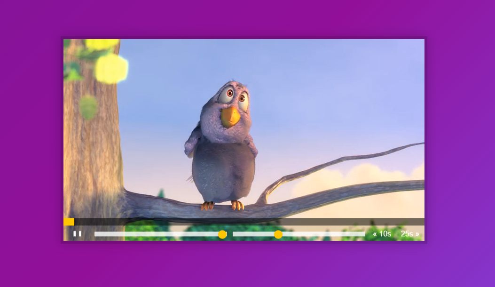

# Custom Video Player



## 소개

<br />

**JS를 이용하여 비디오 설정 하기**

[구경하러 바로 가기](https://sweet-genie-aeb2c2.netlify.app/)

<br />

## CSS & JavaScript Code

<br />

```js

<script>
//js

//Get Our Elements
const player = document.querySelector(".player");
const video = player.querySelector(".viewer");
const progress = player.querySelector(".progress");
const progressBar = player.querySelector(".progress__filled");
const toggle = player.querySelector(".toggle");
const ranges = player.querySelectorAll(".player__slider");
const skipButtons = player.querySelectorAll("[data-skip]");

//Build out functions
function togglePlay() {
  const method = video.paused ? "play" : "pause";
  video[method]();
}

function updateButton() {
  const icon = this.paused ? "►" : "❚ ❚";
  toggle.textContent = icon;
}

function skip() {
  video.currentTime += parseFloat(this.dataset.skip);
}

function handleRangeUpdate() {
  video[this.name] = this.value;
}

function handleProgress() {
  const percent = (video.currentTime / video.duration) * 100;
  progressBar.style.flexBasis = `${percent}%`;
}

function scrup(e) {
  const scrupTime = (e.offsetX / progress.offsetWidth) * video.duration;
  video.currentTime = scrupTime;
}

//Hook up the event listeners

//pause and play
video.addEventListener("click", togglePlay);
//icon
video.addEventListener("play", updateButton);
video.addEventListener("pause", updateButton);
//progress
video.addEventListener("timeupdate", handleProgress);

//For updateButton
toggle.addEventListener("click", togglePlay);

//skip
skipButtons.forEach((button) => button.addEventListener("click", skip));

//range > volume && rate
ranges.forEach((button) =>
  button.addEventListener("change" && "mousemove", handleRangeUpdate)
);

//progress scrup
let mousedown = false;
progress.addEventListener("click", scrup);
progress.addEventListener("mousemove", (e) => mousedown && scrup(e));
progress.addEventListener("mousedown", () => (mousedown = true));
progress.addEventListener("mouseup", () => (mousedown = false));
</script>
```
