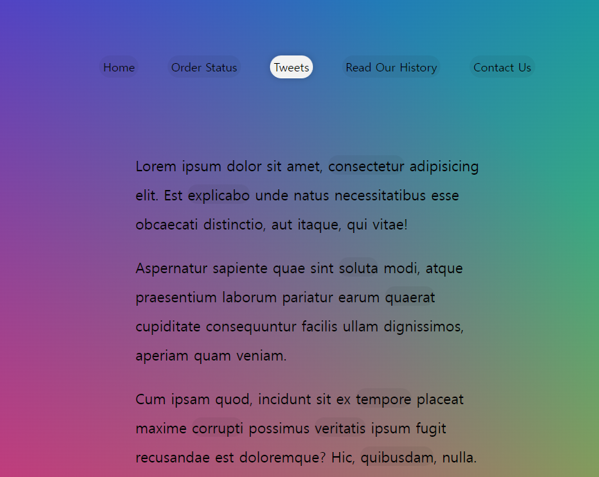

# Follow Along Link Highlighter



## 소개

<br />

**마우스 커서 따라다니는 Highlighter**

[구경하러 바로 가기](https://tranquil-taffy-9081f5.netlify.app/)

<br />

## JavaScript Code

<br />

```js
 <script>
    const triggers = document.querySelectorAll('a');
    const highlight = document.createElement('span');
    highlight.classList.add('highlight');
    document.body.append(highlight);

    function highlightLink(){
      const linkCoords = this.getBoundingClientRect();
      console.log(linkCoords);
      const coords = {
        width: linkCoords.width,
        height: linkCoords.height,
        top: linkCoords.top + window.scrollY,  //스크롤을 내릴수록 값이 작아짐 따라서 더해줘야함.
        left: linkCoords.left + window.scrollX,
      }

      highlight.style.width = `${coords.width}px`;
      highlight.style.height = `${coords.height}px`;
      highlight.style.transform = `translate(${coords.left}px, ${coords.top}px)`;
    }
    triggers.forEach(a=> a.addEventListener('mouseenter', highlightLink));


  </script>

```
