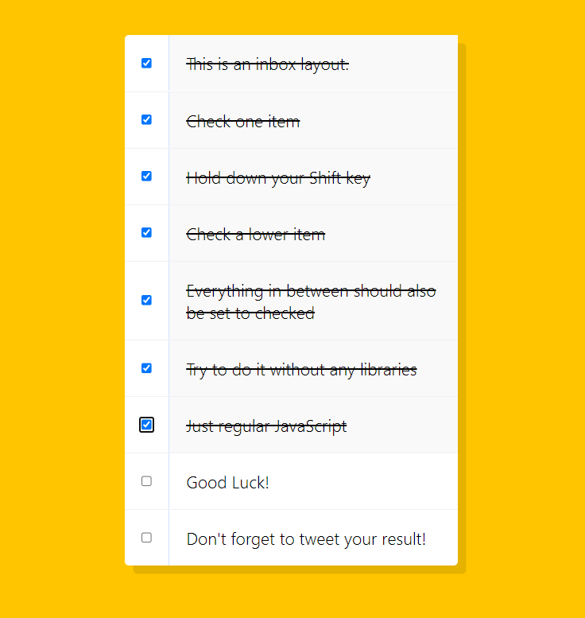

# Hold Shift and Checkbox



<br />

## 소개

<br />

**Shif Key를 활용하여 한 번에 Check 가능한 웹 페이지**

[구경하러 바로 가기](https://dapper-cendol-084fe4.netlify.app/)

<br />

## JavaScript Code

<br />

```js

<script>
//js
const checkboxes = document.querySelectorAll('.inbox input[type = "checkbox"]');

  let lastChecked;

  function handleCheck(e){
    let inBetween = false;
    // Check if they had the shift key down
    // AND check that they are checking it
    if(e.shiftKey && this.checked){
      // go ahead and do what we please
      // loop over every single checkbox
      checkboxes.forEach(checkbox => {
        console.log(checkbox);
        if(checkbox === this || checkbox === lastChecked) {
          inBetween = !inBetween; //flag 변환
          console.log('Starting to check them in between!');
        }
        if(inBetween){
          //true일 때 박스체크
          checkbox.checked = true;
        }
      });
    }

    lastChecked = this;
  }

  checkboxes.forEach(checkbox => checkbox.addEventListener('click', handleCheck));
</script>

```
