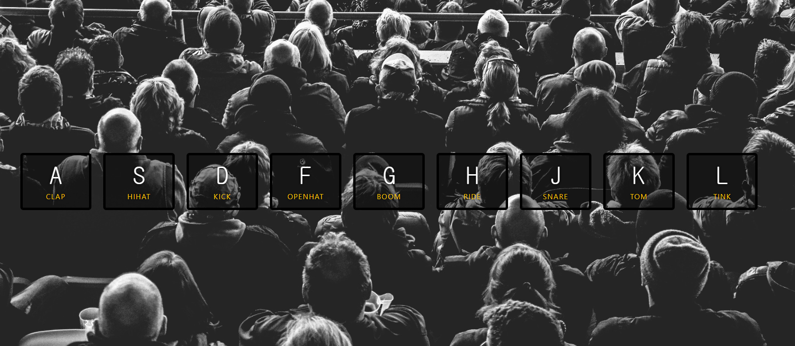

# JavaScript Drum Kit



## 소개

<br />

**해당 키를 누르면 소리가 나는 Drum Kit 입니다**

[구경하러 바로 가기](https://roaring-stroopwafel-8acb12.netlify.app/)

<br />

## JavaScript Code

<br />

```js
<script>

function removeTransition(e){
  if(e.propertyName !== 'transform') {  return; }
  this.classList.remove('playing');
  // e.target.classList.remove('playing');
}

function playSound(e) {
  const audio = document.querySelector (`audio[data-key= "${e.keyCode}"]`);
  const key = document.querySelector (`div[data-key= "${e.keyCode}"]`);
  if(!audio) { return; }

  key.classList.add('playing'); //클래스 애니메이션
  audio.currentTime = 0;  // 대기시간 없이 누를떄마다 바로 소리 나게
  audio.play();  //오디오 실행
}

const keys = Array.from(document.querySelectorAll('.key'));  //각각의 key찾기
keys.forEach(key => key.addEventListener('transitionend', removeTransition ));
window.addEventListener ('keydown',playSound);

</script>
```
