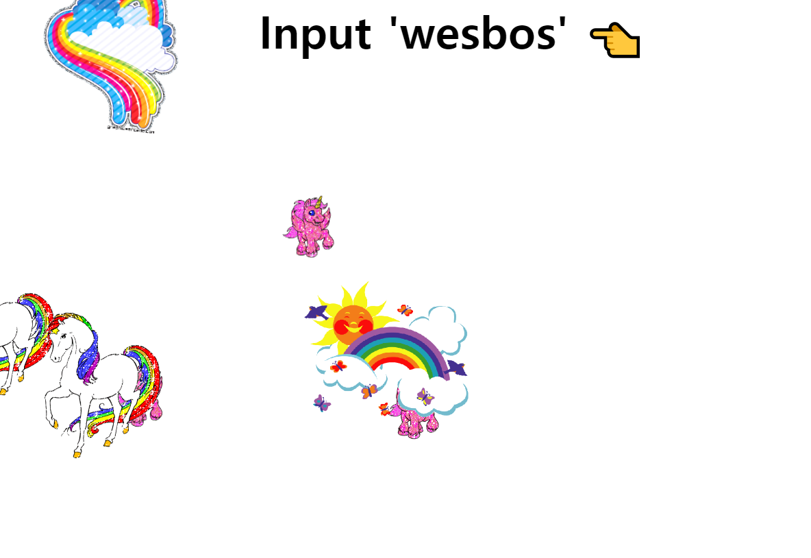

# Key Match



## 소개

<br />

**지정된 단어 입력시 유니콘 등장!!**

[구경하러 바로 가기](https://illustrious-sprinkles-a8fe13.netlify.app/)

<br />

## JavaScript Code

<br />

```js

<script>

const pressed = [];
const secretCode = 'wesbos';

window.addEventListener('keyup', (e)=>{
    console.log(e.key);
    pressed.push(e.key);
    // -붙으면 맨 뒤
    pressed.splice(-secretCode.length - 1, pressed.length - secretCode.length);
    if(pressed.join('').includes(secretCode)){
      console.log("Boomb");
      cornify_add(); //유니콘
    }
    console.log(pressed);
  });

</script>
```
