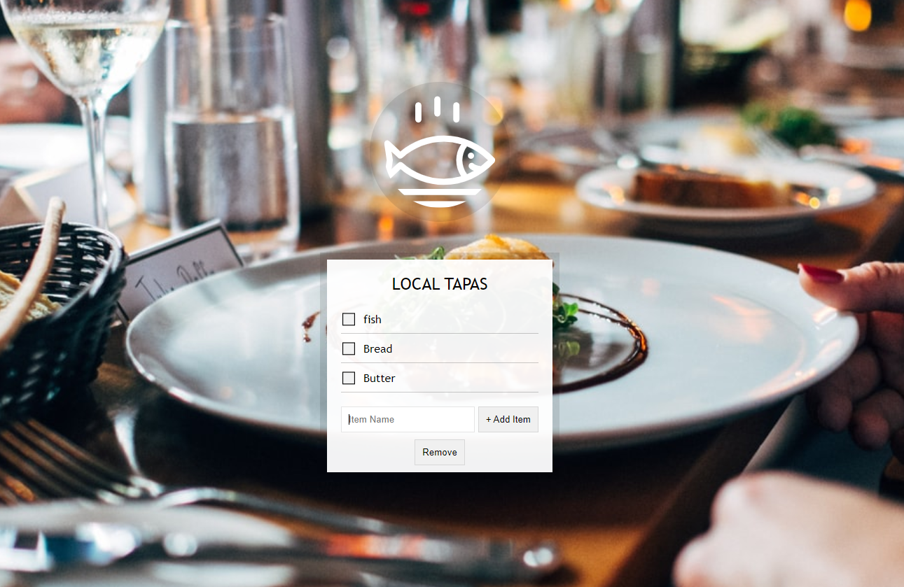

# Type Ahead

<br />



<br />

## 소개

<br />

**Application의 Local Storage를 이용하여 메뉴들을 추가 및 삭제 가능한 웹**

[구경하러 바로 가기](https://regal-malasada-47aaea.netlify.app/)

<br />

## Question?

<br />

### localStorage?

<br />

- localStorage를 사용하면 Document 출처의 Storage 객체에 접근할 수 있다.
- 저장한 데이터는 브라우저 세션 간에 공유된다.
  <br />

```js
localStorage.setItem("myCat", "Tom"); //Storage 객체에 접근 후, 항목 추가

const cat = localStorage.getItem("myCat"); //항목 읽기

localStorage.removeItem("myCat"); //제거

localStorage.clear(); //전체 제거
```

<br />

**본문 예시**
<br />

1. `localStorage.setItem('items',JSON.stringify(items));`
   <br />

- Object => JSON 문자열
  <br />

2. `const items = JSON.parse(localStorage.getItem("items"));`
   <br />

- JSON 문자열 => JS Object

<br />

### 추가 구현

<br />

[**Question**](#question) 에서 공부했으니 삭제 기능을 추가 해보자
<br />

```js
//삭제(추가 기능)
const removeItems = document.querySelector(".remove-items");

function removeItem() {
  items.pop();
  localStorage.removeItem(items);
  localStorage.setItem("items", JSON.stringify(items));
  populateList(items, itemsList);
}
```

<br />

## JavaScript Code

<br />

```js
<script>
  const addItems = document.querySelector('.add-items');
  const itemsList = document.querySelector('.plates');
  const items = JSON.parse(localStorage.getItem('items')) || [];

  function addItem(e){
    e.preventDefault();
    const text = (this.querySelector('[name=item]')).value;
    const item = {
      text,
      done: false
    }
    items.push(item);
    populateList(items, itemsList);
    //page item update
    localStorage.setItem('items',JSON.stringify(items));
    this.reset();
  }

  //항목 추가
  function populateList(plates = [], platesList){
    platesList.innerHTML = plates.map((plate,i)=> {
      //label tag
//       <div class="preference">
//        <label for="cheese">Do you like cheese?</label>
//        <input type="checkbox" name="cheese" id="cheese">
//      </div>
      return `
        <li>
          <input type="checkbox" data-index = ${i} id="item${i}" ${plate.done ? 'checked' : ''} />
          <label for="item${i}">${plate.text}</label>
        </li>
      `;
    }).join('');
  }

  //삭제(추가 기능)
  const removeItems = document.querySelector('.remove-items');

  function removeItem(){
    items.pop();
    localStorage.removeItem(items);
    localStorage.setItem('items',JSON.stringify(items));
    populateList(items, itemsList);
  }

  // check 유지
  function toggleDone(e){
    if(!e.target.matches('input')) return;
    const el = e.target;
    const index = el.dataset.index;
    items[index].done = !items[index].done;
    localStorage.setItem('items',JSON.stringify(items));
    populateList(items,itemsList);
  }

  addItems.addEventListener('submit',addItem);
  itemsList.addEventListener('click',toggleDone)
  removeItems.addEventListener('click',removeItem);

  populateList(items, itemsList);

</script>
```

<br />
