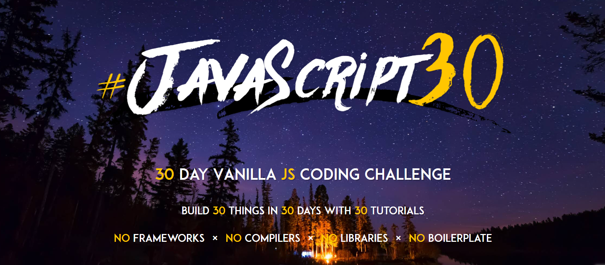

# 30 DAY JavaScript Challenge 🔥🔥

 

## 소개

 

- 30일 동안 꾸준히!!
- Front-End 준비 프로젝트

 

## Challenge 🔥

 

|             Project              |                                 Link                                 | State |   Date   |
| :------------------------------: | :------------------------------------------------------------------: | :---: | :------: |
|       JavaScript Drum Kit        |                   [✏️](./JavaScript%20Drum%20Kit/)                   |  ☑️   | 23.01.19 |
|         JS and CSS Clock         |                   [✏️](./JS%20and%20CSS%20Clock/)                    |  ☑️   | 23.01.20 |
|          CSS Variables           |                       [✏️](./CSS%20Variables/)                       |  ☑️   | 23.01.21 |
|        Array Cardio Day 1        |                  [✏️](./Array%20Cardio%20Day%201/)                   |  ☑️   | 23.01.22 |
|        Flex Panel Gallery        |                   [✏️](./Flex%20Panel%20Gallery/)                    |  ☑️   | 23.01.23 |
|            Type Ahead            |                        [✏️](./Type%20Ahead/)                         |  ☑️   | 23.01.24 |
|        Array Cardio Day2         |                  [✏️](./Array%20Cardio%20Day%202/)                   |  ☑️   | 23.01.25 |
|      Fun with HTML5 Canvas       |                 [✏️](./Fun%20with%20HTML5%20Canvas/)                 |  ☑️   | 23.01.26 |
|       Dev Tools Domination       |                  [✏️](./Dev%20Tools%20Domination/)                   |  ☑️   | 23.01.27 |
| Hold Shift and Check Checkboxes  |           [✏️](./Hold%20Shift%20and%20Check%20Checkboxes/)           |  ☑️   | 23.01.28 |
|       Custom Video Player        |                   [✏️](./Custom%20Video%20Player/)                   |  ☑️   | 23.01.29 |
|      Key Sequence Detection      |                 [✏️](./Key%20Sequence%20Detection/)                  |  ☑️   | 23.01.30 |
|        Slide in on Scroll        |                  [✏️](./Slide%20in%20on%20Scroll/)                   |  ☑️   | 23.01.31 |
| JavaScript References Vs Copying |           [✏️](./JavaScript%20References%20VS%20Copying/)            |  ☑️   | 23.02.01 |
|           LocalStorage           |                        [✏️](./LocalStorage/)                         |  ☑️   | 23.02.02 |
|        Mouse Move Shadow         |                    [✏️](./Mouse%20Move%20Shadow/)                    |  ☑️   | 23.02.03 |
|      Sort Without Articles       |                  [✏️](./Sort%20Without%20Articles/)                  |  ☑️   | 23.02.04 |
|   Adding Up Times with Reduce    |             [✏️](./Adding%20Up%20Times%20with%20Reduce/)             |  ☑️   | 23.02.05 |
|          **Webcam Fun**          |                        [✏️](./Webcam%20Fun/)                         |  ❌   | 23.02.06 |
|       **Speech Detection**       |                     [✏️](./Speech%20Detection/)                      |  ❌   | 23.02.07 |
|         **Gelolcation**          |                         [✏️](./Geolocation/)                         |  ☑️   | 23.02.08 |
|  Follow Along Link Highlighter   |             [✏️](./Follow%20Along%20Link%20Highlighter/)             |  ☑️   | 23.02.09 |
|         Speech Synthesis         |                     [✏️](./Speech%20Synthesis/)                      |  ☑️   | 23.02.10 |
|            Sticky Nav            |                        [✏️](./Sticky%20Nav/)                         |  ☑️   | 23.02.11 |
|     Event Capture , Bubbling     | [✏️](./Event%20Capture%2C%20Propagation%2C%20Bubbling%20and%20Once/) |  ☑️   | 23.02.12 |
