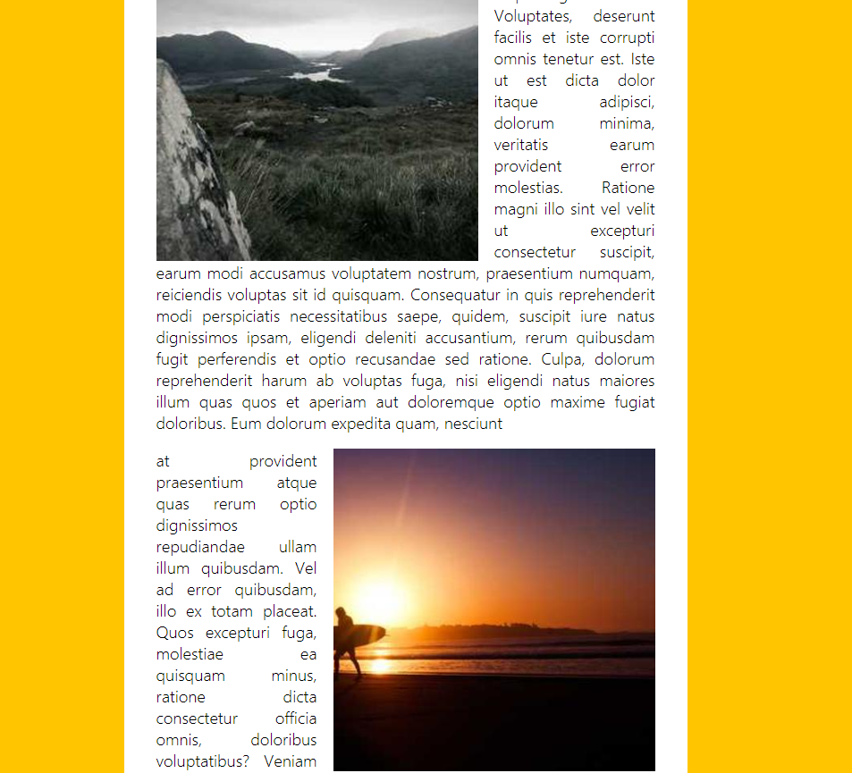

# Slide in on Scroll



## 소개

<br />

**스크롤 할 때 이미지 등장!**

[구경하러 바로 가기](https://glowing-kulfi-510550.netlify.app/)

<br />

## CSS & JavaScript Code

<br />

```css
/*감추고 나타나는*/
.slide-in {
  opacity: 0;
  transition: all 0.5s;
}

.slide-in.active {
  opacity: 1;
  transform: translateX(0%) scale(1);
}

/*등장 방향*/
.align-left.slide-in {
  transform: translateX(-30%) scale(0.95);
}

.align-right.slide-in {
  transform: translateX(30%) scale(0.95);
}
```

```js

 <script>

    //debounce -> 미세한 스크롤 반응 방지
    function debounce(func, wait = 20, immediate = true) {
      var timeout;
      return function() {
        var context = this, args = arguments;
        var later = function() {
          timeout = null;
          if (!immediate) func.apply(context, args);
        };
        var callNow = immediate && !timeout;
        clearTimeout(timeout);
        timeout = setTimeout(later, wait);
        if (callNow) func.apply(context, args);
      };
    }

    const sliderImages = document.querySelectorAll('.slide-in');

    function checkSlide(e){
      sliderImages.forEach(sliderImage => {
        //window.scrollY(스크롤 Y측 방향 px값) + window.innerHeight(브라우저 높이) - image.height / 2(이미지의 반)
        const slideInAt = (window.scrollY + window.innerHeight) - sliderImage.height / 2;

        //offsetTop = 가장 가까운 위치인 의 꼭대기상위 요소.
        //offsetTop(맨 위에서 떨어진 요소(이미지) 첫위치) + image.height(이미지 높이) = 맨위부터 이미지 끝 높이
        const imageBottom = sliderImage.offsetTop + sliderImage.height;

        //flag- 이미지가 반이상이 지나갔는지
        const isHalfShown = slideInAt > sliderImage.offsetTop;
        //flag - 이미지가 viewport를 안 지나났다
        const isNotScrolledPast = window.scrollY < imageBottom;
        if(isHalfShown && isNotScrolledPast){
           sliderImage.classList.add('active');
        }
        else {
           sliderImage.classList.remove('active');
         }
      });
    }

    window.addEventListener('scroll', debounce(checkSlide));

  </script>

```
