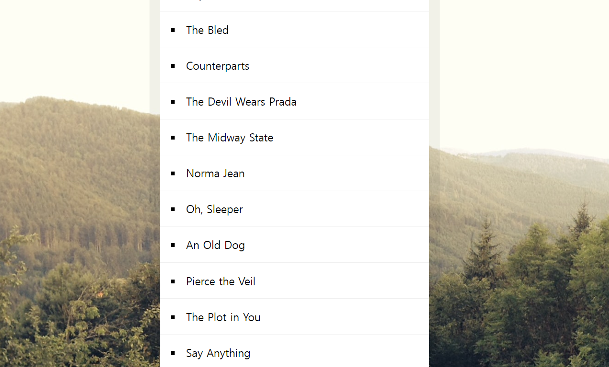

# Sort Without Articles


<br />

## 소개

<br />

**JS로 정렬 하기**

<br />

## JavaScript Code

<br />

```js
<script>
function strip(bandName){
  return bandName.replace(/^(a |the |an )/i,'').trim(); //대소문자 구별없이 검색
}
console.log(strip('The Devil Wears Parda')); // Devil Wears Parda

const bands = ['The Plot in You', 'The Devil Wears Prada', 'Pierce the Veil', 'Norma Jean', 'The Bled', 'Say Anything', 'The Midway State', 'We Came as Romans', 'Counterparts', 'Oh, Sleeper', 'A Skylit Drive', 'Anywhere But Here', 'An Old Dog'];
const sortedBands = bands.sort((a,b)=>  strip(a) > strip(b) ? 1 : -1 );
console.log(sortedBands);

document.querySelector('#bands').innerHTML = sortedBands.map(band => `<li>${band}</li>`).join('');ㄴ
</script>
```
