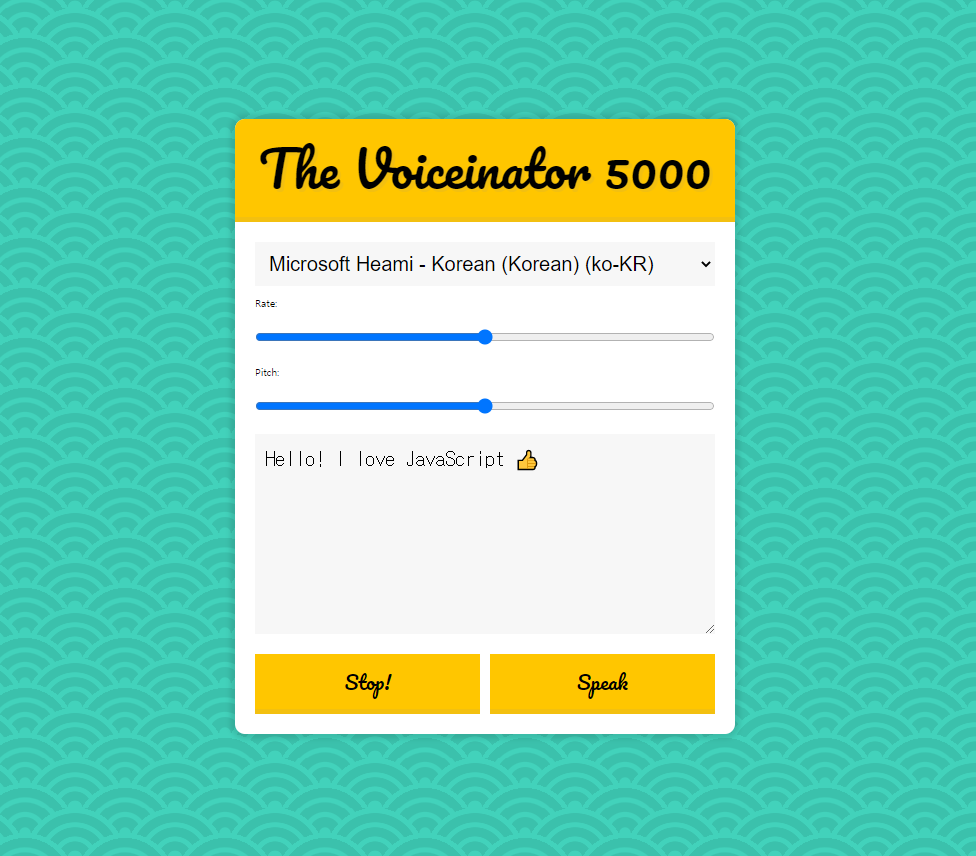

# Speech Synthesis


<br />

## 소개

<br />

**브라우저에서 제공한 오디오가 작성한 text를 대신 읽어주는 웹 서비스**
[구경하러 바로 가기](https://fanciful-semolina-363da4.netlify.app/)

<br />

## JavaScript Code

<br />

```js

<script>
  const msg = new SpeechSynthesisUtterance();
  let voices = [];
  const voicesDropdown = document.querySelector('[name="voice"]');
  const options = document.querySelectorAll('[type="range"], [name="text"]');
  const speakButton = document.querySelector('#speak');
  const stopButton = document.querySelector('#stop');
  msg.text = document.querySelector('[name="text"]').value;

  function populateVoices(){
    voices = this.getVoices();
    voicesDropdown.innerHTML = voices
    .map(voice => `<option value="${voice.name}">${voice.name} (${voice.lang})</option>`)
    .join('')

  }

    function setVoice() {
      msg.voice = voices.find(voice => voice.name === this.value);
      toggle()
    }

    function toggle(startOver = true) { //flag 변수
      speechSynthesis.cancel();
      if(startOver){
      speechSynthesis.speak(msg);
      }
    }

    function setOption(){
      // console.log(this.name, this.value);
      msg[this.name] = this.value;
      toggle();
    }

  speechSynthesis.addEventListener('voiceschanged',populateVoices);
  voicesDropdown.addEventListener('change',setVoice);
  options.forEach(option=> option.addEventListener('change',setOption));
  speakButton.addEventListener('click',toggle);
  stopButton.addEventListener('click', () => toggle(false));
  // stopButton.addEventListener('click', toggle.bind(null, false));

</script>

```
