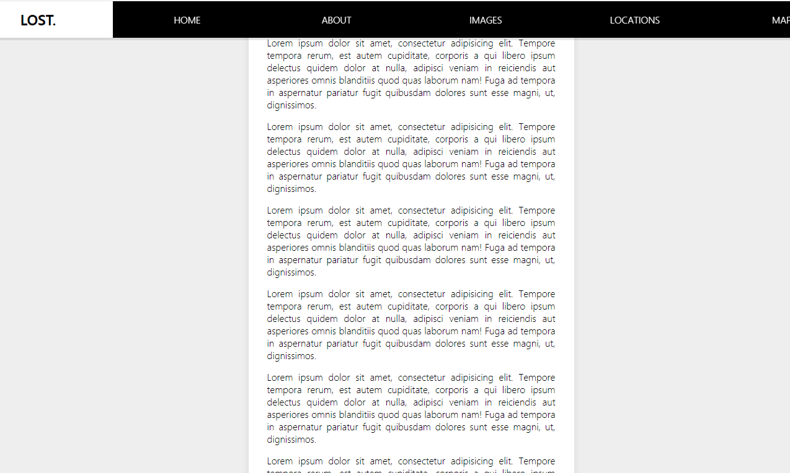

# Sticky Nav



## 소개

<br />

**기사글 Scroll 해도 Main Nav 고정되는 웹**

[구경하러 바로 가기](https://timely-panda-88f196.netlify.app/)

<br />

## CSS & JavaScript Code

<br />

```js
const nav = document.querySelector("#main");
const topOfNav = nav.offsetTop;

function fixNav() {
  // console.log(topOfNav, window.scrollY);
  //class fixed-nav 생성 및 제거
  if (window.scrollY >= topOfNav) {
    document.body.style.paddingTop = nav.offsetHeight + "px";
    document.body.classList.add("fixed-nav");
  } else {
    document.body.style.paddingTop = 0;
    document.body.classList.remove("fixed-nav");
  }
}

window.addEventListener("scroll", fixNav);
```

<br />

```css
/*기사 확장*/
.fixed-nav .site-wrap {
  transform: scale(1);
}
/*main nav 고정*/
.fixed-nav nav {
  position: fixed;
  box-shadow: 0 5px rgba(0, 0, 0, 0.1);
}
/*로고 생성*/
.fixed-nav li.logo {
  max-width: 500px;
}
```
