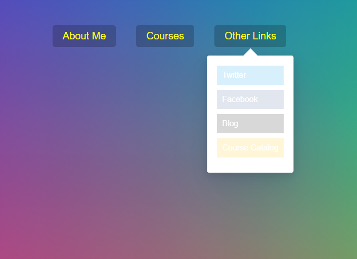

# Stripe Follow Along Nav


<br />

## 소개

<br />

**Nav 따라 움직이는 contents** <br />
[구경하러 바로 가기](https://profound-cheesecake-22f3a4.netlify.app/)

<br />

## JavaScript Code

<br />

```js
<script>
  const triggers = document.querySelectorAll('.cool > li');
  const background = document.querySelector('.dropdownBackground');
  const nav = document.querySelector('.top');

  function handleEnter() {
    this.classList.add('trigger-enter');
    setTimeout(()=> this.classList.contains('trigger-enter')&&this.classList.add('trigger-enter-active'),100);
    background.classList.add('open');


    const dropdown = this.querySelector('.dropdown');
    // console.log(dropdown);
    const dropdownCoords = dropdown.getBoundingClientRect();
    const navCoords = nav.getBoundingClientRect();
    const coords = {
      height: dropdownCoords.height,
      width: dropdownCoords.width,
      top: dropdownCoords.top - navCoords.top, //칸에 맞추기 위해 nav의 영향력 때문
      left: dropdownCoords.left - navCoords.left,
    }

    background.style.setProperty('width', `${coords.width}px`);
    background.style.setProperty('height', `${coords.height}px`);
    background.style.setProperty('transform', `translate(${coords.left}px,${coords.top}px`);
    }

  function handleLeave() {
    this.classList.remove('trigger-enter','trigger-enter-active')
    background.classList.remove('open');
  }
triggers.forEach(trigger=> trigger.addEventListener('mouseenter',handleEnter));
triggers.forEach(trigger=> trigger.addEventListener('mouseleave',handleLeave));

</script>
```
