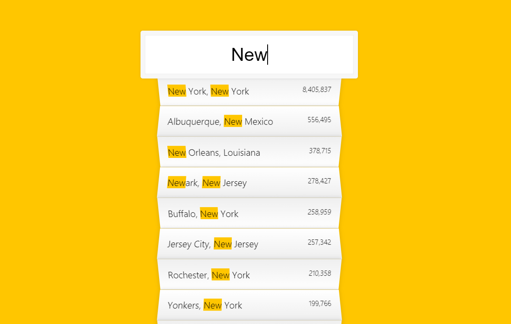

# Type Ahead

<br />



<br />

## 소개

<br />

**JSON 데이터를 받아, 사용자 입력 마다 데이터랑 매치 시켜주는 웹 페이지**

[구경하러 바로 가기](https://dancing-boba-8ef9bf.netlify.app/)

<br />

## Question

<br />

### fecth()??

<br />

- 원격 API를 간편하게 호출할 수 있도록 브라우저에서 제공하는 함수
- fetch() 함수는 첫번째 인자로 URL, 두번째 인자로 옵션 객체를 받고, Promise 타입의 객체를 반환
- 반환된 객체는, API 호출이 성공했을 경우에는 응답(response) 객체를 resolve
- 실패했을 경우에는 예외(error) 객체를 reject
- 디폴트로 GET방식

```js
fetch("https://jsonplaceholder.typicode.com/posts/1").then(
  (response) => console.log(response) //Response {status: 200, ok: true, redirected: false, type: "cors", url: "https://jsonplaceholder.typicode.com/posts/1", …}
);
```

<br />

- 본문 예제

```js
fetch("https://jsonplaceholder.typicode.com/posts/1")
  .then((response) => response.json())
  .then((data) => console.log(data));
이 메서드를 호출하면, 응답(response) 객체로 부터 JSON 포멧의 응답 전문을 자바스크립트 객체로 변환하여 얻을 수 있다.

// {
//   "userId": 1,
//   "id": 1,
//   "title": "sunt aut facere repellat provident occaecati excepturi optio reprehenderit",
//   "body": "quia et suscipit↵suscipit recusandae consequuntur …strum rerum est autem sunt rem eveniet architecto"
// }
```

<br />

### 정규 표현식??

<br />

`g`

- Global 의 표현하며 대상 문자열내에 모든 패턴들을 검색하는 것을 의미한다.
  <br />

`i`

- Ignore case 를 표현하며 대상 문자열에 대해서 대/소문자를 식별하지 않는 것을 의미한다.
  <br />

예제

```plain
1. 개별 숫자 - /[0-9]/g

>> 전체에서  0~9사이에 아무 숫자 '하나'  찾음

2. 개발 문자 - /[to]/g

>> 전체에서 t  혹은 o  를 모두 찾음

3. 이메일 - /^[0-9a-zA-Z]([-_\.]?[0-9a-zA-Z])*@[0-9a-zA-Z]([-_\.]?[0-9a-zA-Z])*\.[a-zA-Z]{2,3}$/i

>> '시작을'  0~9 사이 숫자 or a-z A-Z 알바펫 아무거나로 시작하고  /  중간에 - _  . 같은 문자가 있을수도 있고 없을수도 있으며 /
그 후에 0~9 사이 숫자 or a-z A-Z 알바펫중 하나의 문자가 없거나 연달아 나올수 있으며 /  @ 가 반드시 존재하고  /
0-9a-zA-Z 여기서 하나가 있고  /  중간에 - _  . 같은 문자가 있을수도 있고 없을수도 있으며 / 그 후에 0~9 사이 숫자 or a-z A-Z 알바펫중 하나의
문자가 없거나 연달아 나올수 있으며 /  반드시  .  이 존재하고  / [a-zA-Z] 의 문자가 2개나 3개가 존재 /   이 모든것은 대소문자 구분안함
```

<br />

-fetch와 정규표현식은 [STUDY-NOTE](https://github.com/LEEJINTAEK/StudyNote) 에 기록할 것
<br />

## JavaScript Code

<br />

```js
<script>
//js

  //Json file
const endpoint = 'https://gist.githubusercontent.com/Miserlou/c5cd8364bf9b2420bb29/raw/2bf258763cdddd704f8ffd3ea9a3e81d25e2c6f6/cities.json';

let cities = [];

fetch(endpoint).then(blob => blob.json()).then(data => cities.push(...data));

function findMatches(wordToMatch, cities){
  return cities.filter(place => {
    const regex = new RegExp(wordToMatch, 'gi');
    return place.city.match(regex) || place.state.match(regex);
  });
}

function numberWithCommas(x) {
  return x.toString().replace(/\B(?=(\d{3})+(?!\d))/g, ',');
}

function displayMatches(){
  const matchArray = findMatches(this.value, cities);
  const html = matchArray.map(place => {
    const regex = new RegExp(this.value, 'gi');
    const cityName = place.city.replace(regex, `<span class = "hl">${this.value}</span>`);
    const stateName = place.state.replace(regex, `<span class = "hl">${this.value}</span>`);
    return `
      <li>
        <span class="name">${cityName}, ${stateName}</span>
        <span class="population">${numberWithCommas(place.population)}</span>
      </li>
    `;
  }).join('');
  suggestions.innerHTML = html;
}

const searchInput = document.querySelector('.search');
const suggestions = document.querySelector('.suggestions');

searchInput.addEventListener('change',displayMatches);
searchInput.addEventListener('keyup',displayMatches);
</script>
```

<br />

## 출처

> https://www.daleseo.com/js-window-fetch/

> https://hamait.tistory.com/342
