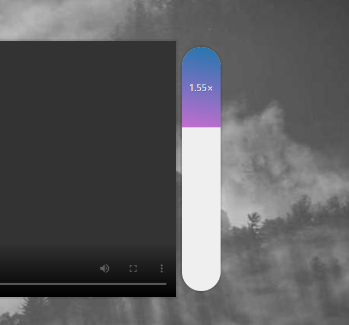

# Video Speed Controller


<br />

## 소개

<br />

**영상 속도를 조절할 수 있는 웹** <br />
[구경하러 바로 가기](https://peaceful-starburst-ce9760.netlify.app/)

<br />

## JavaScript Code

<br />

```js
<script>
  const speed = document.querySelector('.speed');
  const bar = speed.querySelector('.speed-bar');
  const video = document.querySelector('.flex');

  function handleMove(e) {
      const y = e.pageY - this.offsetTop;
      const percent = y / this.offsetHeight;
      const min = 0.4;
      const max = 4;
      const height = Math.round(percent * 100) + '%';
      const playbackRate = percent * (max - min) + min;
      bar.style.height = height;
      bar.textContent = playbackRate.toFixed(2) + '×';
      video.playbackRate = playbackRate;
    }

  speed.addEventListener('mousemove', handleMove);

</script>
```
