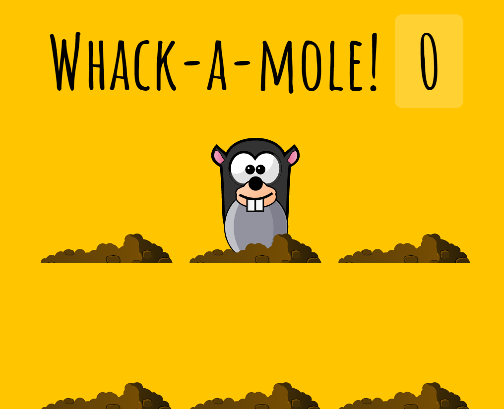

# Whack A Mole


<br />

## 소개

<br />

**두더지 잡기 게임을 구현한 웹** <br />
[구경하러 바로 가기](https://deft-biscotti-de2096.netlify.app/)

<br />

## JavaScript Code

<br />

```js
<script>
  const holes = document.querySelectorAll('.hole');
  const scoreBoard = document.querySelector('.score');
  const moles = document.querySelectorAll('.mole');
  let lastHole
  let timeUp = false
  let score = 0;

  function randomTime(min, max){
    return Math.round(Math.random() * (max - min) + min);
  }

  function randomHole(holes){
    const idx = Math.floor(Math.random() * holes.length);
    const hole = holes[idx];
    //중복 방지
    if(hole === lastHole){
      return randomHole(holes);
    }
    lastHole = hole;
    return hole;
  }
function peep(){
  const time = randomTime(200,1000);
  const hole = randomHole(holes);
  hole.classList.add('up');
  setTimeout(()=>{
    hole.classList.remove('up');
    if(!timeUp){peep();}
  }, 600)
}

function startGame() {
  scoreBoard.textContent = 0;
  timeUp = false;
  score = 0;
  peep();
  setTimeout(()=> timeUp = true, 10000);
}

function bonk(e) {
  console.log(e);
  if(!e.isTrusted) return;
  score ++;
  this.classList.remove('up');
  scoreBoard.textContent = score;
}

moles.forEach(mole => mole.addEventListener('click',bonk));

</script>
```
